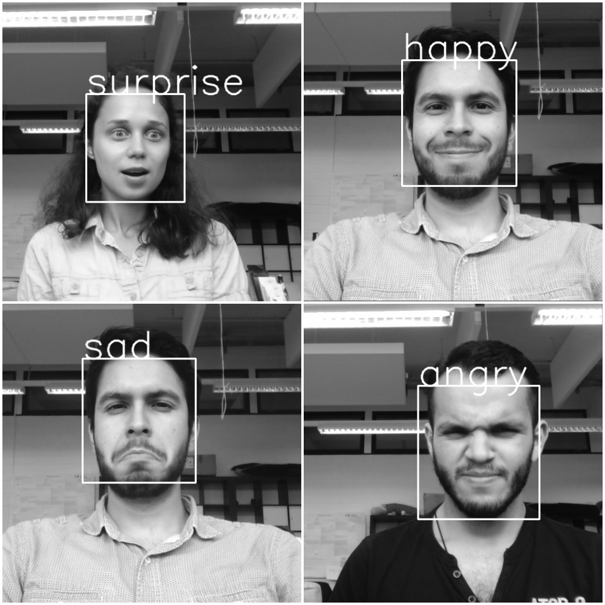

# Face classification and detection
Real-time face detection and emotion/gender classification using fer2013/IMDB datasets with a keras CNN model and openCV.
* IMDB gender classification test accuracy: 96%.
* fer2013 emotion classification test accuracy: 66%.

Emotion/gender classification of the [B-IT-BOTS](https://mas-group.inf.h-brs.de/?page_id=622) robotics team :) 

Emotion examples

## Instructions

### To train previous/new models for emotion classification:

* Download the fer2013.tar.gz file from [here](https://www.kaggle.com/c/challenges-in-representation-learning-facial-expression-recognition-challenge/data)

* Move the downloaded file to the datasets directory inside this repository.

* Untar the file:
> tar -xzf fer2013.tar

* Run the train_emotion_classification.py file
> python3 train_emotion_classifier.py

### To train previous/new models for gender classification:

* Download the imdb_crop.tar file from [here](https://data.vision.ee.ethz.ch/cvl/rrothe/imdb-wiki/) (It's the 7GB button with the tittle Download faces only).

* Move the downloaded file to the datasets directory inside this repository.

* Untar the file:
> tar -xfv imdb_crop.tar

* Run the train_emotion_classification.py file
> python3 train_emotion_classifier.py

