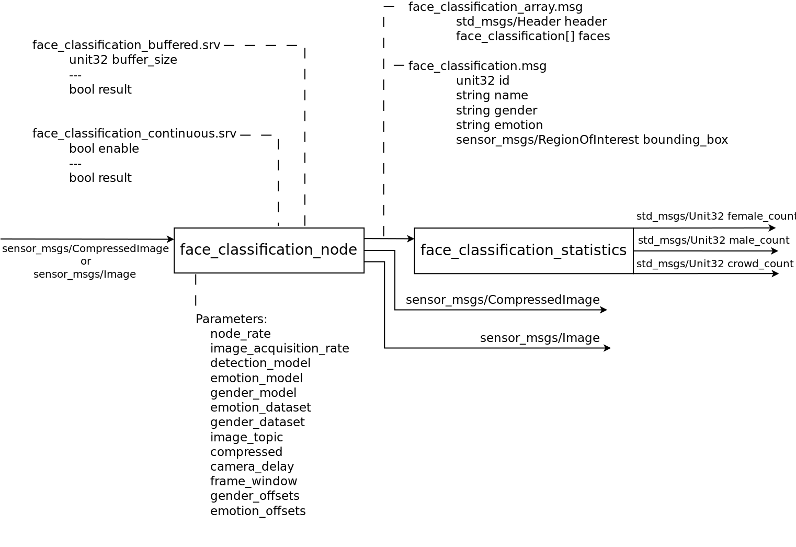

# ROS USAGE

## Schema

This is the node schema, representing the messages that it subscribes and publishes, the parameters and the service that it publishes.

## Buffered Mode

This mode collects a buffer of images and it uses a filter in order to ignore wrong observations.

This node can works in buffer mode if someone publishes at the service face_classification_buffered with the size of the buffer that it's desired. 

## Continuous Mode

This mode is running the face classification in real time.

This node can works in continuous mode if someone publishes at the service face_classification_continuous with True.
